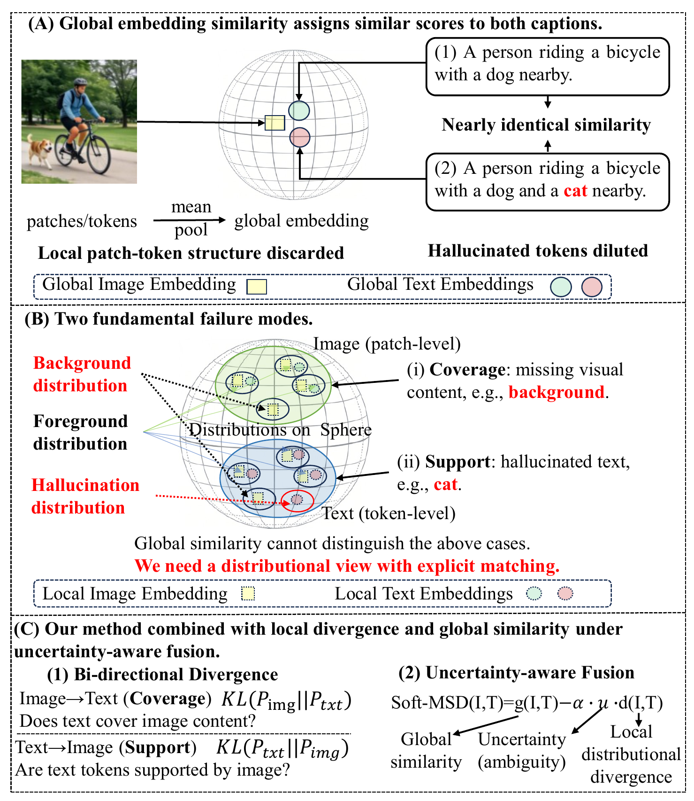
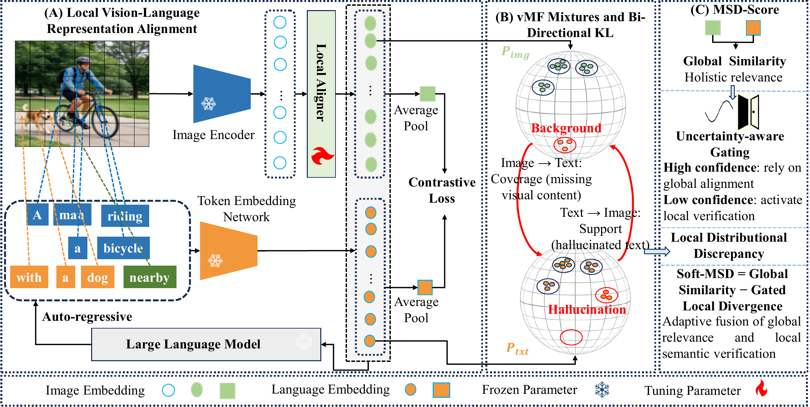
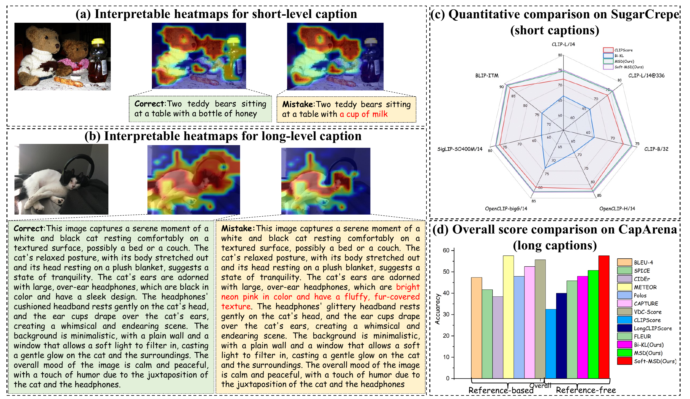
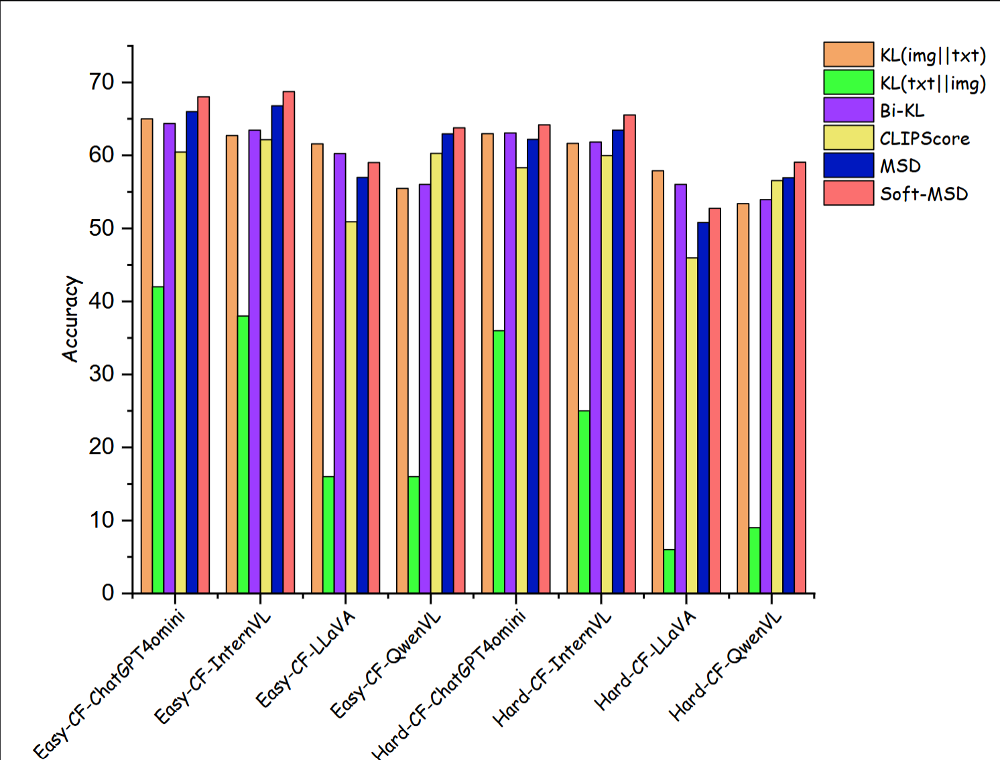

# MSD-Score: Multi-Scale Distributional Scoring for Reference-Free Image Caption Evaluation.

<p align="center">
  <a href="https://arxiv.org/abs/0000.00000">
    
  </a>
  <a href="https://steinsgatesg.github.io/MSDScore/">
    
  </a>
</p>

MSD-Score is a reference-free metric for image caption evaluation. It scores an image-caption pair without using ground-truth reference captions by combining global image-text similarity with local distributional verification. Local image patches and text tokens are modeled as von Mises-Fisher (vMF) mixtures on the unit hypersphere, and semantic discrepancy is measured with a length-aware bi-directional KL divergence.

<p align="center">
  
</p>

## Highlights

- **Reference-free caption evaluation**: score candidate captions directly against images.
- **Multi-scale scoring**: combine global cosine similarity with local patch-token distributional mismatch.
- **Coverage and support diagnostics**: image-to-text KL captures missing visual content; text-to-image KL captures unsupported or hallucinated text.
- **Soft-MSD fusion**: uncertainty-aware gating increases the local correction when global similarity is ambiguous.
- **Deterministic and decomposable**: no LLM is required at inference time for the MSD/Soft-MSD metric.

## Method Overview

Given an image `I` and a caption `T`, MSD-Score extracts normalized image patch embeddings and text token embeddings, fits fixed-concentration vMF mixtures to both sets, and computes a length-aware local divergence:

```text
d(I, T) = beta(L) * KL(P_img || P_txt) + (1 - beta(L)) * KL(P_txt || P_img)
```

The final score combines this local discrepancy with global similarity:

```text
MSD(I, T)      = g(I, T) - alpha * d(I, T)
Soft-MSD(I,T) = g(I, T) - alpha * u * d(I, T)
```

where `g(I,T)` is the global cosine similarity and `u` is an uncertainty term derived from the candidate-level softmax of global scores.

<p align="center">
  
</p>

Default hyperparameters used by the released scripts:

| Hyperparameter | Value | Meaning |
| --- | ---: | --- |
| `KAPPA` | `20.0` | fixed vMF concentration |
| `VMF_MAX_ITER` | `20` | EM iterations |
| `ALPHA` | `0.1` | local divergence weight |
| `TAU` | `0.2` | Soft-MSD global-score temperature |
| `L0` | `20.0` | length transition center |
| `TAU_L` | `3.0` | length transition smoothness |
| short captions | `K_img=3`, `K_txt=2` | SugarCrepe / COCO-CF setting |
| long captions | `K_img=5`, `K_txt=3` | CapArena / DocENT setting |

## Repository Structure

```text
MSD_Score_code/
|-- docs/                            # Static project page for GitHub Pages
|-- data/
|   `-- create_cap/                  # Caption generation utilities
|       |-- GPT/                     # GPT-4o-mini caption generation
|       |-- InternVL/                # InternVL caption generation
|       |-- llava/                   # LLaVA caption generation
|       `-- qwen/                    # Qwen-VL caption generation
|-- metrics/
|   |-- vMF_MSD_Score/               # Main MSD / Soft-MSD evaluation scripts
|   |   |-- calc.py                  # Shared vMF, Bi-KL, and Soft-MSD helpers
|   |   |-- coco_eval_cf.py          # COCO-CF pairwise evaluation
|   |   |-- sugarcrepe_*.py          # SugarCrepe variants for different encoders
|   |   |-- caparena.py              # CapArena pairwise and model-level evaluation
|   |   |-- docent.py                # DocENT / PoSh evaluation
|   |   `-- bucket.py                # Ambiguity bucket analysis
|   `-- GMM/                         # Gaussian-mixture ablations
|-- requirements.txt
`-- README.md
```


## Installation

Create a Python environment:

```bash
conda create -n msdscore python=3.10 -y
conda activate msdscore
```

Install the metric dependencies:

```bash
pip install -r requirements.txt
```

For GPT-based caption generation:

```bash
pip install openai
export OPENAI_API_KEY=YOUR_API_KEY
```

For CapArena and DocENT with LLaVA-style embeddings, install LLaVA separately or set `LLAVA_REPO` to a local LLaVA checkout.

## Path Configuration

Recommended local layout:

```text
MSD_Score_code/
|-- data/
|   |-- images/val2017/
|   |-- SugarCrepe/
|   |-- caparena/
|   `-- docent/
`-- outputs/
```

Common environment variables:

| Variable | Used by | Default |
| --- | --- | --- |
| `IMAGE_DIR` | caption generation | `data/images/val2017` |
| `OUTPUT_DIR` | caption generation | `outputs/...` |
| `COCO_VAL2017_DIR` | SugarCrepe scripts | `data/images/val2017` |
| `SUGARCREPE_JSON` | SugarCrepe scripts | `data/SugarCrepe/*.json` |
| `LLAVA_REPO` | CapArena / DocENT | empty, assumes `llava` is installed |
| `MSD_LLAVA_MODEL_PATH` | CapArena / DocENT | empty, must be set for LLaVA evaluation |

See `.env.example` for a complete path template.

## Quick Start: COCO-CF Pairwise Evaluation

`metrics/vMF_MSD_Score/coco_eval_cf.py` is the most self-contained entry point. It uses a CLIP model to extract global and local embeddings, then reports cosine and Soft-MSD pairwise accuracy.

Prepare a JSON file:

```json
[
  {
    "image_id": 1,
    "image_path": "data/images/val2017/000000000001.jpg",
    "caption": "A dog is running on the beach.",
    "negative_caption": "A cat is running on the beach."
  }
]
```

Run evaluation:

```bash
python metrics/vMF_MSD_Score/coco_eval_cf.py \
  --data_json data/coco_cf/coco_cf_easy.json \
  --judge_model openai/clip-vit-large-patch14 \
  --device cuda
```

For a CPU sanity check:

```bash
python metrics/vMF_MSD_Score/coco_eval_cf.py \
  --data_json data/coco_cf/coco_cf_easy.json \
  --judge_model openai/clip-vit-large-patch14 \
  --device cpu \
  --max_samples 10
```

Expected output includes:

```text
Cosine Acc : ...
Soft-MSD   : ...
```

## Benchmark Scripts

### SugarCrepe

SugarCrepe scripts are located under `metrics/vMF_MSD_Score/`:

```bash
python metrics/vMF_MSD_Score/sugarcrepe_clip.py
python metrics/vMF_MSD_Score/sugarcrepe_siglip.py
python metrics/vMF_MSD_Score/sugarcrepe_blip.py
python metrics/vMF_MSD_Score/sugarcrepe_big_g.py
python metrics/vMF_MSD_Score/sugarcrepe_clip_h_14.py
```

Set paths through environment variables before running:

```bash
export SUGARCREPE_JSON=data/SugarCrepe/replace_att.json
export COCO_VAL2017_DIR=data/images/val2017
export CLIP_MODEL_ID=openai/clip-vit-large-patch14
```

### COCO-CF

Use the CLI entry point:

```bash
python metrics/vMF_MSD_Score/coco_eval_cf.py \
  --data_json data/coco_cf/coco_cf_easy.json \
  --judge_model openai/clip-vit-large-patch14 \
  --device cuda
```

The script supports JSON files either as a raw list or as a dictionary with a `data` field.

### CapArena

CapArena evaluation uses LLaVA-style embeddings and computes both caption-level agreement and model-level Elo/rank correlation.

Run with explicit LLaVA paths:

```bash
python metrics/vMF_MSD_Score/caparena.py \
  --json_path data/caparena/caparena_annots_eval.json \
  --img_root data/caparena/page_all_images \
  --llava_repo "$LLAVA_REPO" \
  --model_path "$MSD_LLAVA_MODEL_PATH" \
  --model_name llava \
  --shuffle_rounds 5
```

The expected JSON fields include `img`, `caption1`, `caption2`, `source1`, `source2`, `winner`, and `cluster`.

### DocENT / PoSh

DocENT evaluation uses parquet datasets loaded through Hugging Face `datasets`:

```bash
python metrics/vMF_MSD_Score/docent.py \
  --coarse_path data/docent/coarse_annotations \
  --image_path data/docent/images_parquet \
  --coarse_split train \
  --image_split train \
  --llava_repo "$LLAVA_REPO" \
  --model_path "$MSD_LLAVA_MODEL_PATH" \
  --model_name llava
```

The script reports Kendall tau, Spearman rho, Pearson correlation, and binary accuracy.

## Caption Generation Utilities

Caption generation scripts are provided for building candidate captions used in COCO-CF and related experiments:

```text
data/create_cap/llava/llava_caption.py
data/create_cap/qwen/qwen_caption.py
data/create_cap/InternVL/create_caption.py
data/create_cap/GPT/gpt_cap.py
```

Each script contains a configuration block for `MODEL_PATH`, `IMAGE_DIR`, `OUTPUT_DIR`, `MAX_IMAGES`, and decoding settings. The generated files are saved as `results_step_*.json`, mapping image filenames to generated captions.

For GPT-4o-mini generation:

```bash
export OPENAI_API_KEY=YOUR_API_KEY
export IMAGE_DIR=data/images/val2017
export OUTPUT_DIR=outputs/coco_descriptions_gpt4omini
python data/create_cap/GPT/gpt_cap.py
```

If you use a different API endpoint or model, set `OPENAI_BASE_URL` and `OPENAI_MODEL`.

## Local Aligner Checkpoints

MSD-Score can use a lightweight local vision-language aligner on frozen backbones. A frozen LLaMA model is used only as a training-time reconstruction regularizer and is removed at inference.

This release keeps the metric and benchmark code self-contained. For CapArena and DocENT, use either a standard LLaVA checkpoint or your trained local-aligner checkpoint through:

```bash
python metrics/vMF_MSD_Score/caparena.py \
  --llava_repo "$LLAVA_REPO" \
  --model_path "$MSD_LLAVA_MODEL_PATH" \
  --model_name llava \
  --json_path data/caparena/caparena_annots_eval.json \
  --img_root data/caparena/page_all_images
```

The original full training stack depends on external LLaVA, LLaMA, CC3M/LLaVA-style training data, and local checkpoint paths, so it is not vendored in this minimal GitHub package.

## Reported Results

Soft-MSD improves reference-free alignment on both human-annotated and controlled diagnostic benchmarks.

<p align="center">
  
</p>

| Benchmark | Main metric | Soft-MSD result |
| --- | --- | ---: |
| CapArena | caption-level agreement | `57.6` |
| DocENT / PoSh | overall binary accuracy | `64.8` |
| COCO-CF Easy | pairwise accuracy | `63.89` |
| COCO-CF Hard | pairwise accuracy | `59.38` |
| Pascal-50S | mean pairwise accuracy | `86.9` |

The full experiments compare against CLIPScore, LongCLIPScore, FLEUR, reference-based metrics, and VLM-as-a-Judge baselines.

<p align="center">
  
</p>

## Notes

- The MSD/Soft-MSD metric itself does not need reference captions.
- The LLM reconstruction objective is used only while training the local aligner, not during inference.
- The vMF normalization constant is omitted because fixed `kappa` makes it cancel in EM responsibilities and KL differences.
- GMM scripts under `metrics/GMM/` are ablations and are not the main recommended metric.
- This repository does not redistribute pretrained model weights or benchmark datasets; download them from their original sources and follow their licenses.

## Citation

If you use this code, please cite:

```bibtex
@misc{kan2026msdscore,
  title   = {MSD-Score: Multi-Scale Distributional Scoring for Reference-Free Image Caption Evaluation},
  author  = {Kan, Shichao and Zhang, Xuyang and Zhang, Haojie and Zhu, Zhe and Cen, Yigang and Liang, Yixiong and Shan, Lianlei and Zhang, Linna and Qu, Zhe and Xia, Jiazhi},
  year    = {2026}
}
```
